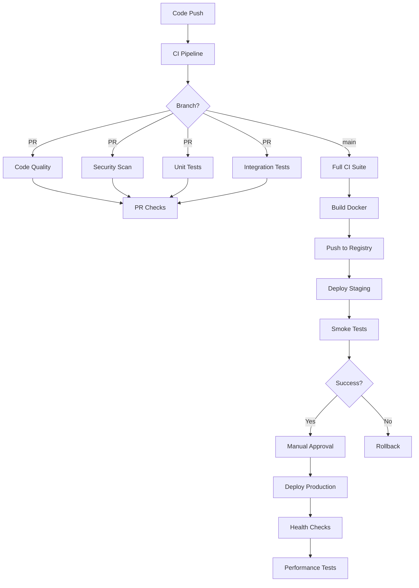

# CI/CD Pipeline Improvements

## 🚀 Overview

This document outlines the comprehensive CI/CD improvements implemented for the backend application. The new pipeline follows industry best practices for continuous integration, continuous deployment, security, and monitoring.

## 📋 Table of Contents

1. [Current Setup Analysis](#current-setup-analysis)
2. [Implemented Improvements](#implemented-improvements)
3. [Pipeline Architecture](#pipeline-architecture)
4. [Security Enhancements](#security-enhancements)
5. [Deployment Strategies](#deployment-strategies)
6. [Monitoring & Observability](#monitoring--observability)
7. [Setup Instructions](#setup-instructions)
8. [Best Practices](#best-practices)

## Current Setup Analysis

### ❌ Issues with Current Setup

1. **Basic CI only** - Only runs tests on multiple Node versions
2. **No code quality checks** - Missing linting, formatting validation
3. **No security scanning** - No vulnerability or secret scanning
4. **No deployment pipeline** - Manual deployment required
5. **No containerization in CI** - Docker not tested in pipeline
6. **No performance testing** - No load testing or benchmarks
7. **No coverage reporting** - Test coverage not tracked
8. **No caching** - Dependencies downloaded every run

## Implemented Improvements

### ✅ New CI Pipeline (`ci.yml`)

#### 1. **Code Quality Job**
- ESLint validation
- Prettier formatting check
- TypeScript type checking
- Runs on every push and PR

#### 2. **Security Scanning Job**
- npm audit for dependencies
- Snyk integration for vulnerability scanning
- Runs in parallel with other jobs

#### 3. **Enhanced Testing**
- Unit tests with coverage reporting
- Integration tests with real PostgreSQL
- E2E testing environment
- Coverage upload to Codecov
- Test artifacts storage

#### 4. **Docker Build & Scan**
- Multi-stage Docker build
- Trivy vulnerability scanning
- SBOM generation
- Image caching for faster builds

#### 5. **SonarCloud Integration**
- Code quality analysis
- Security hotspot detection
- Technical debt tracking
- Quality gate enforcement

#### 6. **Performance Testing**
- k6 load testing
- Performance benchmarks
- Results tracking over time

### ✅ New CD Pipeline (`cd.yml`)

#### 1. **Multi-Environment Deployment**
- Staging environment
- Production environment
- Environment-specific configurations

#### 2. **Blue-Green Deployment**
- Zero-downtime deployments
- Easy rollback capability
- Gradual traffic switching

#### 3. **Container Registry**
- GitHub Container Registry integration
- Multi-architecture images (amd64, arm64)
- Semantic versioning

#### 4. **Automated Rollback**
- Manual trigger for emergencies
- Automatic on health check failures

### ✅ Security Pipeline (`security.yml`)

#### 1. **Scheduled Security Scans**
- Weekly dependency scanning
- Secret detection (TruffleHog, GitLeaks)
- Container vulnerability scanning
- SAST with Semgrep and NodeJsScan
- License compliance checking

#### 2. **Security Reporting**
- Automated issue creation
- SARIF format for GitHub Security tab
- Consolidated security reports

## Pipeline Architecture



## Security Enhancements

### 🔒 Security Measures

1. **Secret Management**
   - GitHub Secrets for sensitive data
   - Kubernetes Secrets for runtime
   - No hardcoded credentials

2. **Vulnerability Scanning**
   - Dependencies (npm audit, Snyk)
   - Containers (Trivy, Grype)
   - Code (Semgrep, NodeJsScan)

3. **Supply Chain Security**
   - SBOM generation
   - License compliance
   - Dependency pinning

4. **Runtime Security**
   - Non-root containers
   - Security contexts in Kubernetes
   - Network policies

## Deployment Strategies

### 🚢 Deployment Options

1. **Blue-Green Deployment**
   - Two identical environments
   - Instant switching
   - Quick rollback

2. **Rolling Updates**
   - Gradual replacement
   - Zero downtime
   - Resource efficient

3. **Canary Deployments**
   - Gradual traffic shift
   - Risk mitigation
   - A/B testing capability

## Monitoring & Observability

### 📊 Metrics & Monitoring

1. **Application Metrics**
   - Prometheus integration
   - Custom metrics
   - Performance tracking

2. **Logging**
   - Centralized logging
   - Error tracking
   - Audit logs

3. **Alerting**
   - Slack notifications
   - Email alerts
   - PagerDuty integration

## Setup Instructions

### Prerequisites

1. **GitHub Secrets to Configure:**
   ```
   CODECOV_TOKEN        # From codecov.io
   SNYK_TOKEN          # From snyk.io
   SONAR_TOKEN         # From sonarcloud.io
   SLACK_WEBHOOK       # Slack incoming webhook
   STAGING_KUBECONFIG  # Base64 encoded kubeconfig
   PRODUCTION_KUBECONFIG # Base64 encoded kubeconfig
   STAGING_TEST_TOKEN  # API token for staging tests
   PRODUCTION_TEST_TOKEN # API token for production tests
   ```

2. **External Services:**
   - Codecov account
   - Snyk account
   - SonarCloud project
   - Container registry access
   - Kubernetes clusters

### Initial Setup

1. **Enable GitHub Actions:**
   ```bash
   # Push the workflow files
   git add .github/workflows/
   git commit -m "Add comprehensive CI/CD pipelines"
   git push
   ```

2. **Configure SonarCloud:**
   - Update `sonar-project.properties` with your organization
   - Add SONAR_TOKEN to GitHub Secrets

3. **Setup Kubernetes:**
   ```bash
   # Create namespace
   kubectl create namespace production
   kubectl create namespace staging
   
   # Apply configurations
   kubectl apply -f kubernetes/
   
   # Create secrets
   kubectl create secret generic backend-secrets \
     --from-literal=db-host=your-db-host \
     --from-literal=db-username=your-db-user \
     --from-literal=db-password=your-db-pass \
     --from-literal=db-name=your-db-name \
     --from-literal=jwt-secret=your-jwt-secret \
     --from-literal=smtp-user=your-smtp-user \
     --from-literal=smtp-pass=your-smtp-pass \
     -n production
   ```

4. **Docker Registry Setup:**
   ```bash
   # Login to GitHub Container Registry
   echo $GITHUB_TOKEN | docker login ghcr.io -u USERNAME --password-stdin
   
   # Create Kubernetes pull secret
   kubectl create secret docker-registry ghcr-secret \
     --docker-server=ghcr.io \
     --docker-username=USERNAME \
     --docker-password=$GITHUB_TOKEN \
     -n production
   ```

## Best Practices

### ✨ Recommendations

1. **Branch Protection**
   - Require PR reviews
   - Require status checks
   - Dismiss stale reviews
   - Require up-to-date branches

2. **Semantic Versioning**
   - Use conventional commits
   - Automated version bumping
   - Changelog generation

3. **Testing Strategy**
   - Maintain >80% code coverage
   - Write integration tests for APIs
   - Performance testing for critical paths

4. **Security**
   - Regular dependency updates
   - Security training for team
   - Incident response plan

5. **Documentation**
   - Keep README updated
   - Document API changes
   - Maintain runbooks

## Monitoring Dashboard

### Recommended Metrics to Track

1. **Pipeline Metrics**
   - Build success rate
   - Average build time
   - Test pass rate
   - Deployment frequency

2. **Application Metrics**
   - Response time (p50, p95, p99)
   - Error rate
   - Request rate
   - Database query time

3. **Infrastructure Metrics**
   - CPU utilization
   - Memory usage
   - Pod restart count
   - Network latency

## Cost Optimization

1. **GitHub Actions**
   - Use self-hosted runners for heavy workloads
   - Optimize workflow triggers
   - Use caching effectively

2. **Container Registry**
   - Implement retention policies
   - Use multi-stage builds
   - Compress images

3. **Kubernetes**
   - Right-size resources
   - Use autoscaling
   - Implement pod disruption budgets

## Troubleshooting

### Common Issues

1. **Pipeline Failures**
   ```bash
   # Check workflow logs
   gh run list --workflow=ci.yml
   gh run view RUN_ID --log
   ```

2. **Deployment Issues**
   ```bash
   # Check pod status
   kubectl get pods -n production
   kubectl describe pod POD_NAME -n production
   kubectl logs POD_NAME -n production
   ```

3. **Performance Problems**
   ```bash
   # Run local performance test
   k6 run test/performance/load-test.js
   ```

## Future Enhancements

1. **GitOps with ArgoCD**
   - Declarative deployments
   - Git as source of truth
   - Automated sync

2. **Service Mesh (Istio)**
   - Advanced traffic management
   - Security policies
   - Observability

3. **Chaos Engineering**
   - Failure injection
   - Resilience testing
   - Automated recovery

4. **ML-based Anomaly Detection**
   - Predictive scaling
   - Incident prevention
   - Smart alerting

## Conclusion

The implemented CI/CD pipeline provides:

- ✅ Comprehensive testing and quality checks
- ✅ Security scanning at multiple levels
- ✅ Automated deployments with rollback
- ✅ Performance testing and monitoring
- ✅ Multi-environment support
- ✅ Container-based deployments
- ✅ Blue-green deployment strategy

This setup ensures high-quality, secure, and reliable software delivery with minimal manual intervention.